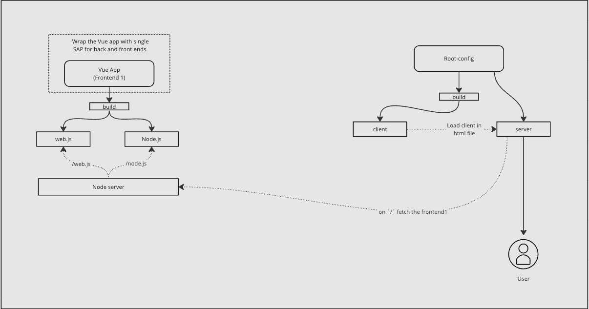

# Single SPA SSR Example



# Setup
```
git clone https://github.com/isaurssaurav/single-spa-ssr.git

cd single-spa-ssr

npm i
```

1. SSR app setup

```
cd packages/mf-app-ssr-vue

npm run serve
```
**Node and web entry point is served from `http:localhost:3000`**

2. Copy the URL where the entry point is served and paste it to .env inside `packages/root-config`

3. Single SPA root config setup

```
cd package/root-config

npm run serve
```

4. Open `http:localhost:4000`. Here, the vue app is served as micro frontend.

