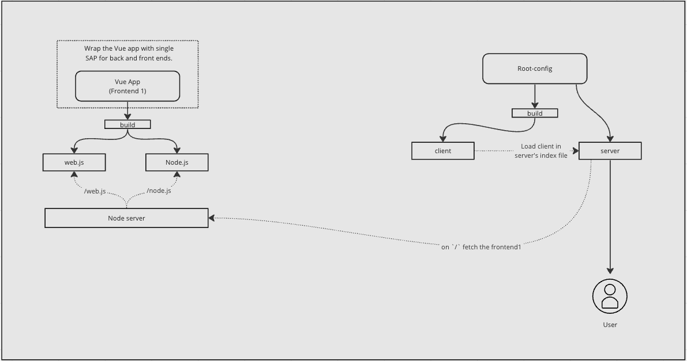

# Single SPA SSR Example



# Setup
```
npm i
```
### 1. SSR Frontend setup

```
cd packages/mf-app-ssr-vue

npm run serve
```

### 2. Copy the URL where the SSR frontend is server and paste it to .env inside `packages/root-config`

### 3. Single SPA root config setup

```
cd package/root-config

```

### 4. open `http:localhost:4000`
Here vue app is served as micro frontend.

